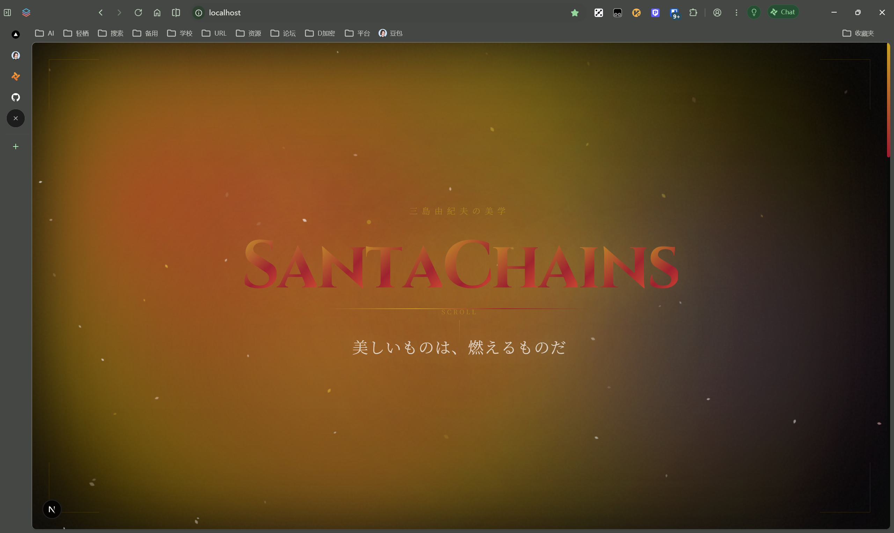

# SantaChains Blog

> *「美しいものは、燃えるものだ」—— 三島由紀夫*

一个充满三岛由纪夫美学风格的个人博客，融合毁灭与美的辩证、古典与现代的碰撞。




## 设计哲学

### 色彩系统

| 色彩 | 色值 | 象征 |
|------|------|------|
| **金阁金** | `#C9A227` | 永恒之美、毁灭的辉煌 |
| **猩红** | `#9B1B30` | 血与激情、生命的炽烈 |
| **深海蓝** | `#1a365d` | 记忆与深渊、无限之境 |
| **火焰橙** | `#FF6B35` | 太阳与铁、肉体的神殿 |
| **月华银** | `#c0c0c0` | 反射之美、间接的优雅 |
| **墨黑** | `#0a0a0a` | 空无与包容、死亡的静谧 |

### 字体搭配

- **Noto Serif SC** - 正文衬线字体，营造古典文学氛围
- **Cinzel** - 标题装饰字体，呼应罗马古典美学

## 动效系统

### 背景层
- **AuroraBackground** - Canvas 流体噪声动画，模拟极光流动
- **SakuraParticles** - 50+ 樱花花瓣粒子，随风飘舞旋转
- **CursorGlow** - 鼠标跟随光晕，双弹簧物理延迟效果

### 交互层
- **Hero 区域** - 逐字动画入场、动态语录轮播、滚动视差
- **QuoteCard** - 悬停光晕、展开/收起详情、标签筛选
- **滚动触发** - 元素进入视口时的模糊淡入动画

## 技术栈

- **Framework**: Next.js 15 (App Router)
- **Styling**: Tailwind CSS v4
- **Animation**: Framer Motion + GSAP
- **UI Components**: shadcn/ui
- **Language**: TypeScript

## 项目结构

```
src/
├── app/
│   ├── components/
│   │   ├── AuroraBackground.tsx   # 极光流体背景
│   │   ├── SakuraParticles.tsx    # 樱花粒子效果
│   │   ├── CursorGlow.tsx         # 鼠标跟随光晕
│   │   ├── Hero.tsx               # 首屏英雄区
│   │   ├── QuoteCard.tsx          # 语录卡片
│   │   ├── QuotesSection.tsx      # 语录列表区
│   │   └── Footer.tsx             # 页脚
│   ├── data/
│   │   └── quotes.ts              # 语录数据
│   ├── globals.css                # 全局样式
│   ├── layout.tsx                 # 根布局
│   └── page.tsx                   # 首页
```

## 语录精选

博客收录 12 条原创语录，融合以下作品意象：

- **《金阁寺》** - 毁灭与永恒的辩证
- **《潮骚》** - 海与记忆的境界
- **《假面的告白》** - 镜与自我的对峙
- **《丰饶之海》** - 轮回与美的四部曲
- **《太阳与铁》** - 肉体与精神的合一
- **《禁色》** - 爱与欲望的迷宫

## 本地开发

```bash
git clone https://github.com/SantaChains/MishimaYukio-style
cd MishimaYukio-style
npm install
npm run dev
```

访问 http://localhost:3000 查看效果。

## 主题筛选

支持按色彩主题筛选语录：

- 🟡 **金閣** - 永恒与毁灭
- 🔴 **紅蓮** - 激情与血
- 🔵 **深海** - 记忆与深渊
- 🟠 **焔** - 太阳与肉体
- ⚪ **月華** - 反射与优雅

## 部署

推荐使用 [Vercel](https://vercel.com) 部署：

```bash
npm i -g vercel
vercel
```

## 致谢

- 三島由紀夫 - 美学与文学的永恒灯塔
- [Next.js](https://nextjs.org) - React 框架
- [Tailwind CSS](https://tailwindcss.com) - 原子化 CSS
- [Framer Motion](https://www.framer.com/motion) - 动画库

---

*「言葉は、血に変わる」*

**SantaChains** © 2026
